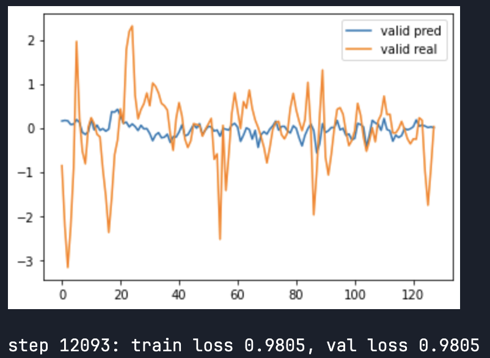

# Jane Street Competition

This repo contains the notebook that reproduces the model and training schedule that I submitted to the competition. All of this code was done in about 15-20 days, so I couldn't iterate much on it and as a consequence the code can contain some bugs or errors.

## Explanation

The notebook implements an encoder-decoder transformer of around 1.5M parameters (customizable) and trains it using scheduled sampling and decoder-step-based sampling probabilities.

### Model Architecture
 1. The model takes a decoded sequence, a tensor of categorical variables, a tensor of continuous variables, a mask for when continuous variables are NaN, a tensor containing the responders of the previous day, a tensor containing the time_ids of the decoded sequence and a tensor that tells the model if a token in the decoded sequence is a golden token or a model generated token.
 2. An embedding dimension is generated for each one of the tensors, using nn.Embedding for int types and nn.Linear for float types.
 3. The positional embeddings and nan mask embeddings are added to the feature tensors. NaN features have their embeddings set to 0. The result is normalized.
 4. Categorical and continuous features are concatenated and normalized on the embedding dimension.
 5. The time dimension is reduced using Conv2d using a kernel size and stride of 2 (can be customized). Kernel and stride also are set to 1 to ensure the features are not mixed together.
 6. The features dimension is reduced using a sequential of nn.Linear layers. The output_dim of the reduction can be customized, but I took the number of tags present in features.csv and responders.csv (16 and 4 respectively). The first layer is initialized with the correlation coefficient of the .csv provided.
 7. These reductions take advantage of correlation and are done in order to speed up the attention computation.
 8. The encoded data tensor is generated by concatenating these two output dims. This will be the sequence fed to the encoder blocks.
 9. Positional and synthetic flag embeddings are added to the decoded sequence. This will be the sequence fed to the decoder blocks.
 10. Non-causal self attention is performed on the encoded sequence. RoPE is applied (make sure float32 is used!) to the sequence and learnable lambdas are used for the skip connections of the value tensor (has been shown to improve performance on shallow nets). The rest of the module is a straightforward attention implementation so I won't comment on it.
 11. Non-causal self attention is performed on the decoded sequence as well.
 12. Both attended sequences are used for cross attention.
 13. Repeat the above steps for the number of layers. 
 14. Normalization is used on the final result, which is then passed through 2 linear layers to get the final prediction.

### Model Training
 - N days (equal to batch_size) are sampled randomly. After each forward pass we roll the sliding window 1 step.
 - We perform 32 forward steps (customizable) and use the prediction previously generated or the golden token depending on an exponential schedule based on the number of iterations and the decoder step. The further we are in the sequence and the higher the training iteration the higher the probability of sampling from the model.
 - When the end of the day is reached we sample another set of days and continue.
 - Note that the sample probability is based on the max number of decoder steps. While using the length of the decoded sequence is the first approach this can lead to an artifficially supressed loss (of around 0.6). Since during inference the sequence loses all information quickly, it is best to reduce the number significantly (treat it as another hyperparameter).
 - I used the SOAP optimizer. I've found that when training transformers the convergence is way faster with SOAP than with AdamW.

### Results
Training went really well, with a loss of around 0.98 on fully self-generated sequences. However I couldn't manage to translate this result to the test set used in the submission. I've thought about it and my main assumptions are:
 - A bug (leaking) during training. I've checked a bit and I'm pretty sure there is none, but I could be missing something.
 - A bug in my submission notebook. I checked as well and I don't think there is a bug there, but given the difficulty of debugging in a Kaggle environment I'm less confident.
 - The test set used to score the submission is quite different from my validation set. Since I only use about 8 days of validation (across 32 symbols, so 64 days in total) and those days are close to my training set this is what I consider to be the most plausible explanation. This means that if I had implemented online learning my submission score would have probably been much higher, but since I only had 15-20 days to write all the code and run the training (which took around 12 hours) I did not have too much time to iterate on that.
<p align="center"></p>

### Further Work
With more time and resources I probably would have given to the transformer all the information about all the symbols available on each time_id. This would've meant that the model would've had around 45M parameters and training would've been much slower, but I think the loss would've been also lower, since features could have been computed across symbols.

### References
 - All the code provided is done by me except for the SOAP optimizer (https://github.com/nikhilvyas/SOAP) and some setup options taken from karpathy's nanoGPT (https://github.com/karpathy/nanoGPT).
 - https://arxiv.org/abs/1506.03099 for more information on scheduled sampling.
 - https://aclanthology.org/2021.emnlp-main.264.pdf for decoder-step and iter-based sample probabilities.

## Setup for reproduction

There is a Makefile included with all the required commands needed to build the project and a pyproject.toml that defines the dependencies.

In order to install uv:
```bash
make setup-uv
```

In order to install the dependencies:
```bash
make install
```

## Requirements to run the notebook

 - The notebook loads all the dataframes from the competition into memory. If one wants to run this with less than 30GB of RAM he/she will need to load the dataframes into chunks and load only what is being trained on.
 -  It is assumed that dataframes are saved and read separately, but one can read from a global folder and index them in a dictionary with minimal code changes.
 - torch.compile is recommended for faster training, it can still be disabled if an older GPU is used.
 - bfloat16 is recommended for efficient training. If an older GPU is used float16 can be used too, a scaler is included if this is the case.
 - Adapt the batch_size number according to the amount of memory your GPU has. 32 steps for scheduled sampling and 16 batch_size works well in 16GB of VRAM.
